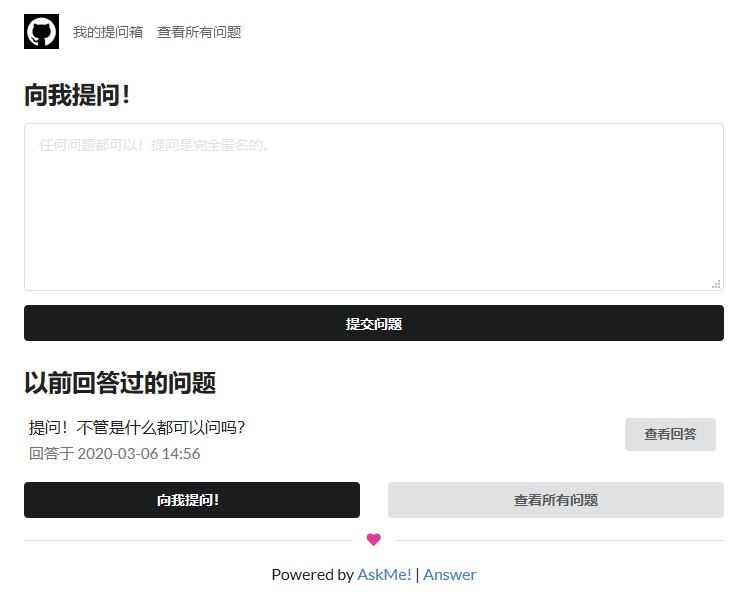
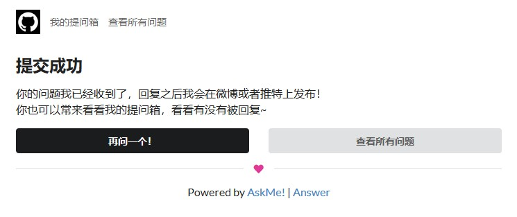
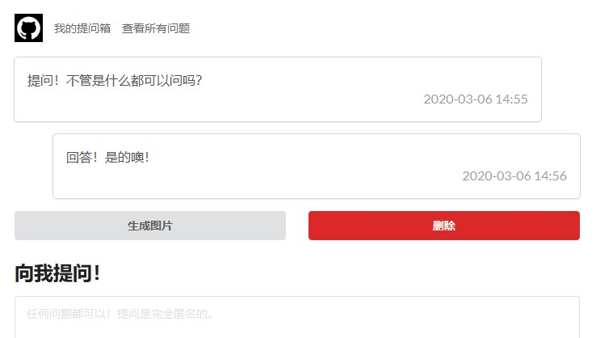
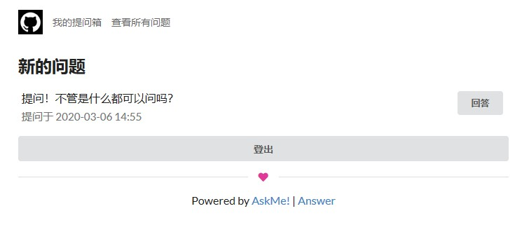

# AskMe!

一个简洁的自建提问箱系统。

## 特色

* 简洁轻量、依赖少
* 开源、无追踪，不记录提交者身份
* 使用 PHP+SQLite 数据库，部署方便

## 预览图

|  |  |  |  | 
|---|---|---|---|
| 首页 | 问题提交 | 查看历史 | 回答 |

## 安装

### 下载

直接下载源码或 Release 源码包即可。

### 安装

复制 `config.example.php` 文件为 `config.php`，并修改其中选项。其中 `site_secret` 可以使用任意文本随意生成，建议在 16 个字符以上。

## 授权协议

[AGPLv3](./LICENSE)
